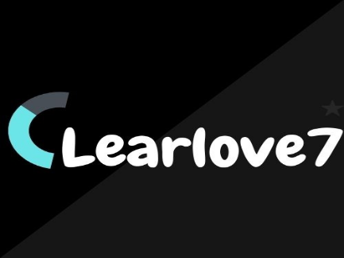

# Hi am ClearLove7💻 #
### Dev Programming Languages

    
    
    
    
    
   
    
 
## Application ChatBotCL7 ##
+ Using heroku  
+ Link : https://chatbotclearlove7.herokuapp.com/?fbclid=IwAR2Xhp6tpNfIXlP1ynG8FzfzOJTvpNbZlagLFzVuS7aRq1hDvZzDexklcdw
+ Page app : https://www.facebook.com/Bot-117828560890633 

## Projects ##

 

 

 

 

## Most Used Languages ##

## GitHub Stats ##

